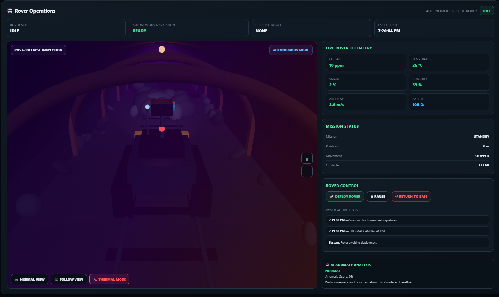
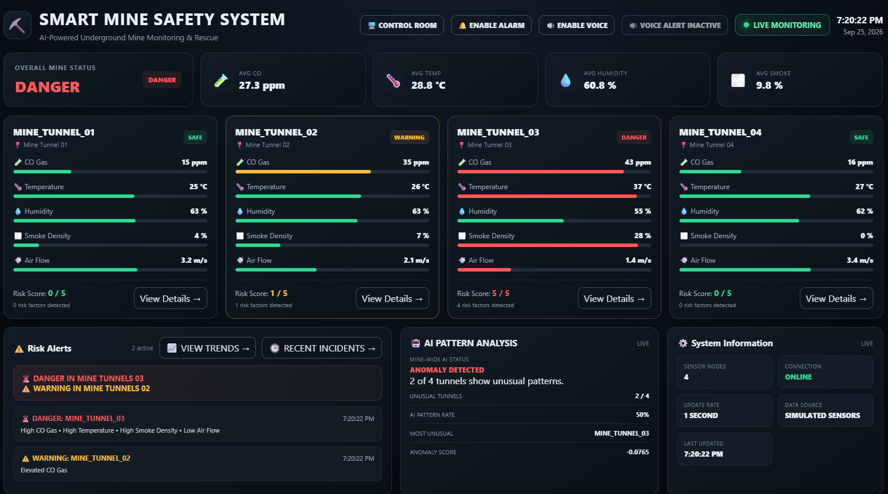
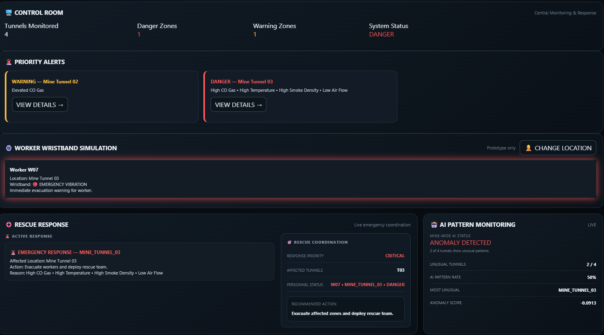

# Smart Mine Safety System

An underground mine safety, monitoring and rescue prototype developed for
Smart India Hackathon 2026.

## Overview

The Smart Mine Safety System is designed to monitor underground mine
conditions, identify abnormal environmental patterns, and provide
operators with a centralized control-room dashboard for monitoring and
response.

The prototype combines simulated sensor nodes, a FastAPI backend,
real-time monitoring, risk classification, anomaly detection, worker
wristband simulation, and a 3D autonomous rescue rover simulation for
post-collapse inspection.

## Key Features

- 🌡️ Real-time environmental sensor monitoring
- ⚠️ Risk classification based on environmental conditions
- 📊 Live control-room monitoring dashboard
- 🚨 Risk alerts and emergency response interface
- 🤖 3D autonomous rescue rover simulation
- 🪨 Post-collapse mine inspection simulation
- 🌡️ Simulated thermal inspection mode
- 📡 Sensor and rover telemetry through REST APIs
- 🧠 Sensor-pattern anomaly detection
- 🧑‍🚒 Worker wristband emergency simulation
- 🧪 Controlled and randomized sensor-data simulation

## Dashboard

The main dashboard provides a centralized view of mine conditions, including CO, temperature, humidity, smoke density, air flow, risk levels, alerts, and anomaly analysis.



## Rover Operations

The prototype includes a 3D autonomous rescue rover simulation designed to demonstrate post-collapse inspection, autonomous navigation, obstacle handling, telemetry, and simulated thermal inspection.



## Control Room & Rescue Response

The control-room interface provides priority alerts, worker status, rescue response information, and mine-wide anomaly monitoring.



## System Architecture

```text
Sensor Simulator
       ↓
FastAPI Backend
       ↓
Sensor Processing & Risk Analysis
       ↓
Control Room Dashboard
       ↓
Alerts / Worker Monitoring / Rover Telemetry
       ↓
3D Rescue Rover Simulation